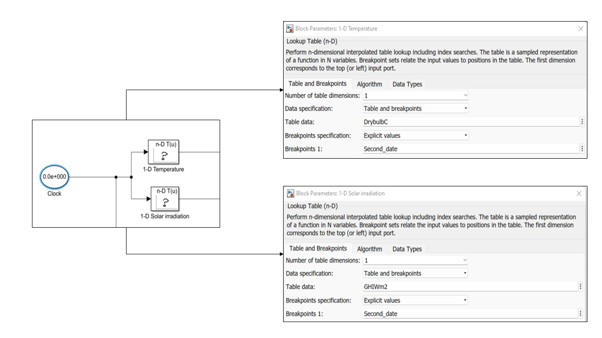
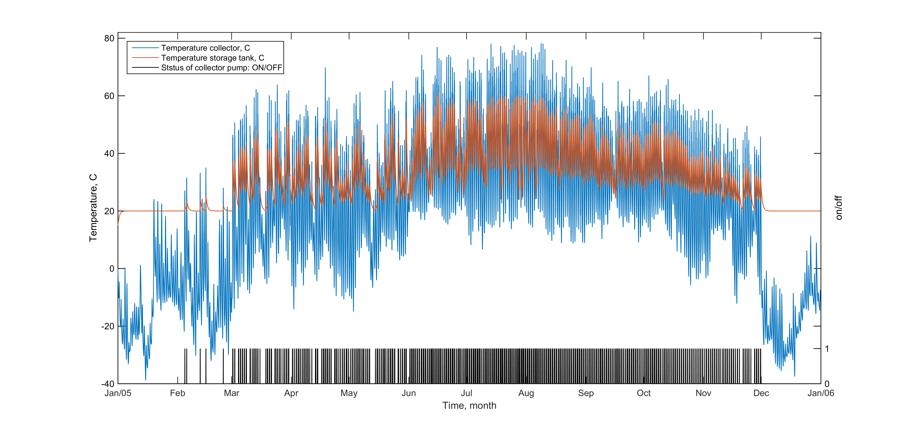

# Simulation-of-solar-flat-collector

## Description

This library provides a simulation of a flat solar collector for the water heating system with the Kazakhstan climate condition. The simulation of the solar heating system is done in Matlab (Simulink). The solar system is simulated by the mathematical model (ODE model) of energy.

## Data 

DData was collected for the Almaty region, Kazakhstan, and for one year. In the [Data](https://github.com/TimuMZh/Data) folder there are 2 files. Files contain time in sec. with one hour step and solar irradiation and ambient temperature:
1. [Time_serial_irradiation_Almaty](https://github.com/TimuMZh/Data/Time_serial_irradiation_Almaty.csv) is irradiation of Almaty city location.
2. [Time_serial_temperature_Almaty](https://github.com/TimuMZh/Data/Time_serial_temperature_Almaty.csv) is ambient temperature of Almaty city ocation

## Example
Numerical simulations were conducted for different examples such as one year, 3, and 9 days data.

Steps to run the simulation:
1. To import data (irradiation and temperature) into the workspace of the Matlab session.
2. To add data to the model simulation:
  - For 1-D Temperature, select *Temperature* instead of *DrybulbC* in Table data and *Time_h* instead of *Breakpoints 1*. 
  - For 1-D Solar irradiation, select *Solar_irradiation W* instead of *GHIWm2* in Table data and *Time_h* instead of *Breakpoints 1*.  

<p align="center">

</p>

## Visualization result

The .m files [Plotting_one_year_data](https://github.com/TimuMZh/Plotting_one_year_data.m) and [Plotting_3_days_data](https://github.com/TimuMZh/Plotting_3_days_data.m) ploted the result of simulation. Below you can see the result of simulation:

<p align="center">

</p>

If you found this library useful in your research, please consider citing.
```
@article{merembayev2020thermal,
  title={Thermal loss analysis of a solar flat collector using numerical simulation},
  author={Merembayev, Timur and Amirgaliyev, Yedilkhan and Kunelbayev, Murat and Berdyshev, Abdumauvlen},
  year={2020},
  publisher={engrXiv}
}

@inproceedings{yedilkhan2018dynamic,
  title={Dynamic simulation of a solar hot water heating system for Kazakhstan climate conditions},
  author={Yedilkhan, Amirgaliyev and Merembayev, Timur and Kunelbayev, Murat},
  booktitle={2018 14th International Conference on Electronics Computer and Computation (ICECCO)},
  pages={206--212},
  year={2018},
  organization={IEEE}
}
```
